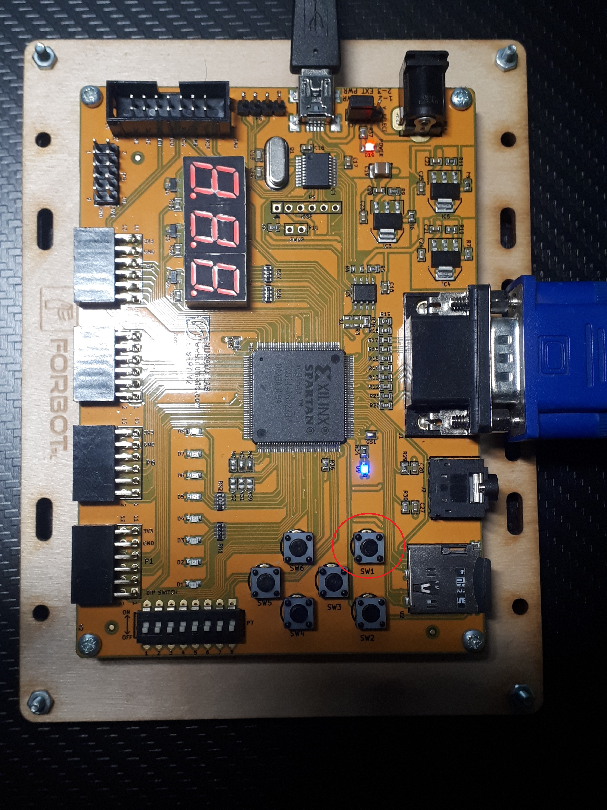
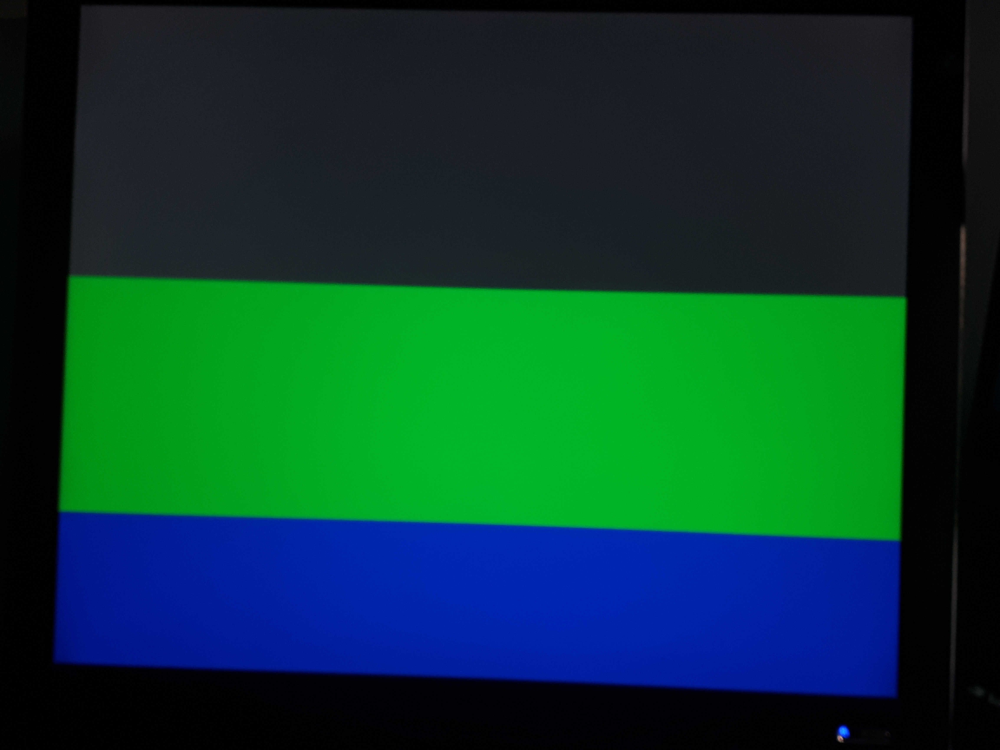
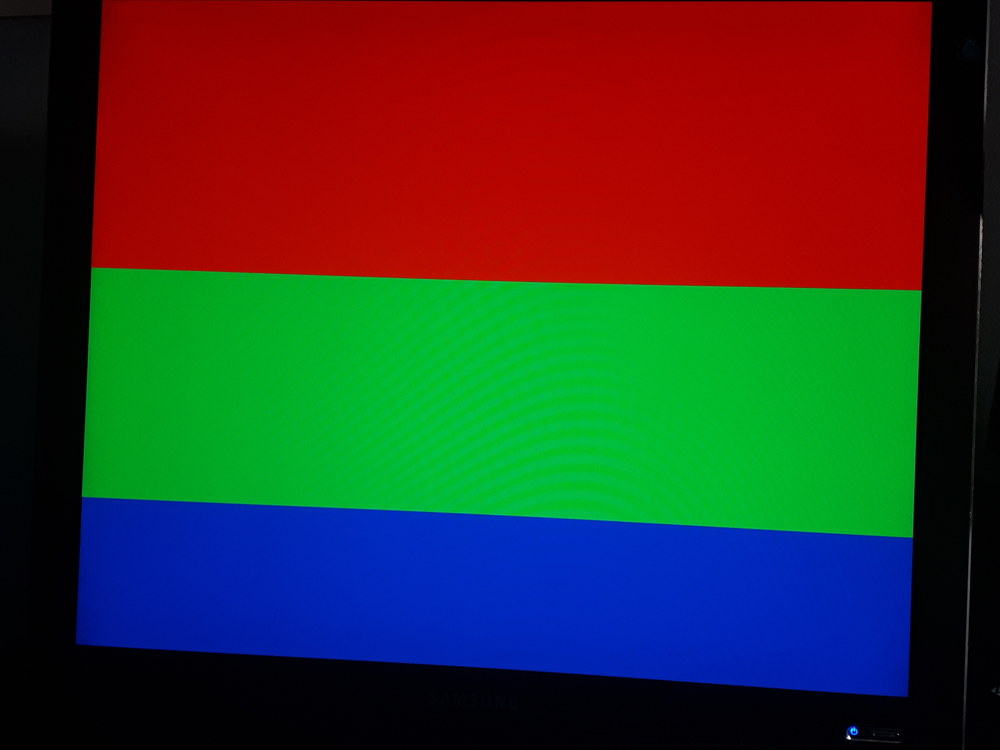

# VGA_TESTER
A VHDL project showing the use of a button to switch the color on a VGA screen.

## Setup
1. Open the `vga_tester.xise` file in the Xilinx ISE Editor.
2. Click on the `top_module.vhd` file in the Design panel.
3. In the Processes panel below double click on `Generate Programming File`.
4. Open the `ElbertV2Config.exe` application, choose the generated `.bin` file and the port to wich the FPGA board is connected to.
5. Connect a VGA screen to the FPGA board.

## Demo
1. Click on the SW1 button to observe the color change on the VGA screen

